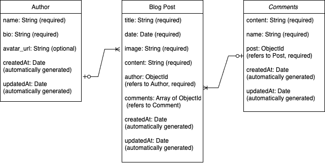

# Full-Stack Project - Travel Land Blog

## Description
Travel Land Blog is a full-stack application that allows users to create, edit, and delete travel blog posts. Users can also write comments on each post, fostering interaction and sharing of experiences. The website is designed to provide a seamless and engaging user experience for travel enthusiasts.

## Features
- **Create Posts**: Users can create new blog posts with titles, content, and images.
- **Edit Posts**: Users have the ability to edit their existing posts.
- **Delete Posts**: Users can remove posts they no longer wish to display.
- **Comments Section**: Users can leave comments on each post, enabling discussions and feedback.
- **Responsive Design**: The application is styled to ensure a consistent and polished user interface across devices.

## Technologies Used
- **Frontend**: HTML, CSS, JavaScript
- **Backend**: Node.js, Express.js
- **Database**: MongoDB (with Mongoose for data modeling)
- **API**: Axios for making HTTP requests

## ERD
- **Author to Post**: One-to-Many (An author can create many posts, but each post is written by one author)
- **Post to Comment**: One-to-Many (A post can have many comments, but each comment is associated with one post)

## MVP
- Implement full CRUD functionality for blog posts.
- Enable users to comment on posts.
- Create a polished and user-friendly interface.

## Installation
**You need to ensure the following packages are installed:**
- **Express**: For creating the server.
- **Mongoose**: For MongoDB interaction.
- **Morgan**: For logging requests.
- **CORS**: For handling Cross-Origin Resource Sharing.
1. Clone the repository: `git clone https://github.com/alinelmuller/TravelLand`
2. Navigate to the project directory: cd TravelLand
3. TermiInstall the necessary packages: npm install express mongoose morgan cors
4. Run the server: node server.js
5. Run in development mode: npm run dev
Make sure you have the appropriate script in your package.json for this command to work. For example 
"scripts": {
    "dev": "nodemon server.js"
}
6. Open your browser and visit `http://localhost:3001` to see the app in action.

## Author
Aline Muller - A passionate front-end developer with a love for travel and skiing, currently based in Calgary, Alberta.